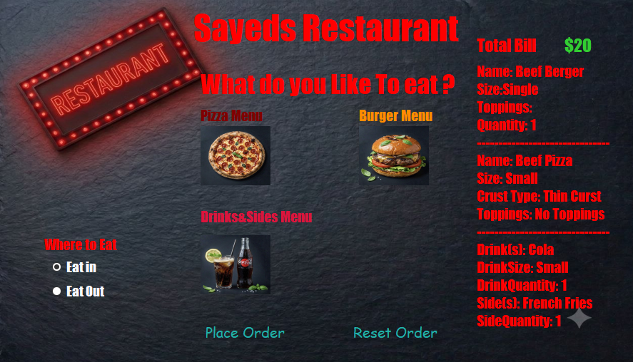
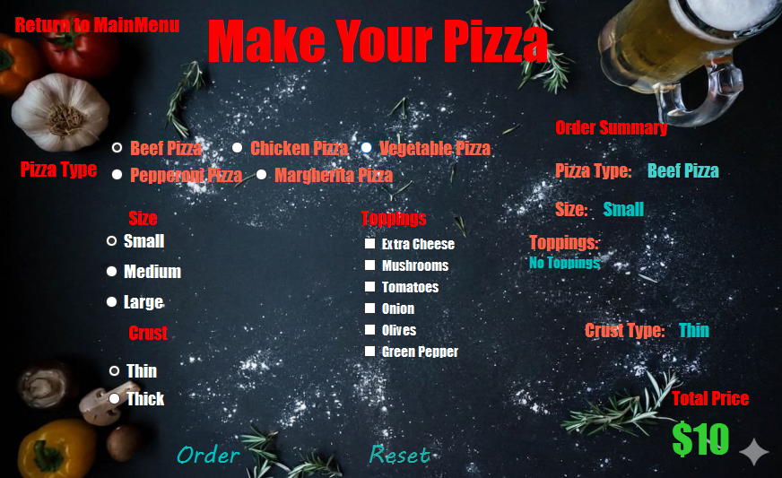
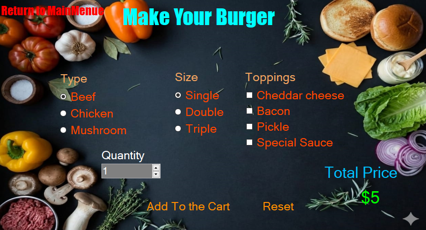
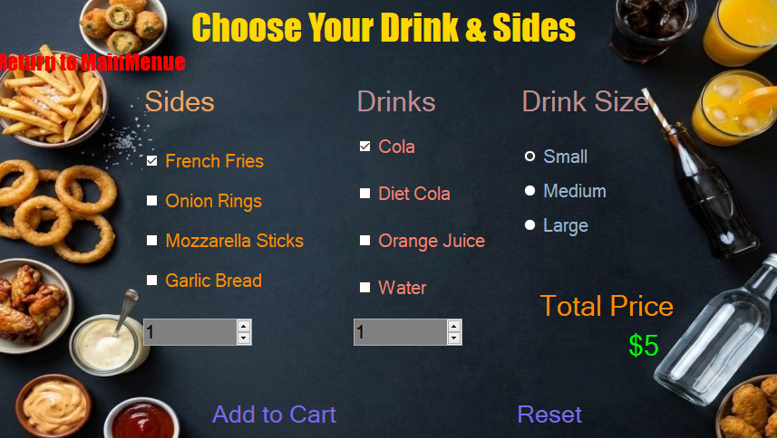

# Sayeds Restaurant Management System 🍔🍕🥤

A robust, object-oriented Windows Forms application built with C# and .NET Framework. This project simulates a real-world restaurant ordering desk where users can seamlessly build custom pizza, burger, and drinks/sides orders. It emphasizes core Object-Oriented Programming (OOP) architectures, clean user experience (UX), and dynamic UI updates.

---

## 🚀 Key Features

*   Dynamic Interactive Menu: Switch seamlessly between Pizza, Burger, and Drinks & Sides menus via a polished dashboard.
*   Highly Customizable Ordering: 
    *   Pizza: Choose types (Beef, Chicken, Veggie, Pepperoni, Margherita), size, crust style (Thin/Thick), and multiple toppings with instant real-time price calculations.
    *   Burger: Configure patty type, size layers (Single, Double, Triple), and specialized toppings/sauces with precise quantity selectors.
    *   Drinks & Sides: Handle multiple item selection, distinct sizes, and custom quantities simultaneously.
*   Real-time Invoice Generation: Leverages OOP polymorphism to generate a unified, scannable text-based bill summary on the main interface.
*   Polished User Experience: Includes safety constraints (preventing empty orders), order confirmation dialogues, complete form resets, and interactive UI visual transitions on button hovers.

---

## 🛠️ Software Architecture & Design Patterns

The project follows clean coding standards and strongly showcases the fundamental principles of Object-Oriented Programming (OOP):

### 1. Inheritance & Polymorphism
The core architectural strength lies in how orders are modeled. All specific menu items inherit from a single base class:
*   OrderItem *(Base Class)*: Holds generic shared parameters like item name, size, unit price, and order quantity. It defines a virtual summary printing routine.
*   PizzaOrder, BurgerOrder, Drinks_SidesOrder *(Derived Classes)*: Inherit from OrderItem and override the default summary routine to append specific configurations (e.g., crust type, toppings, or distinct sides).

### 2. Unified Interface Ingestion
The main dashboard utilizes a single open-ended ingestion method:
*   OrderBill(OrderItem OrderSummary)
By receiving the abstract base class type, the main form handles any menu item polymorphically, fetching individual custom summaries without tight coupling or hardcoded structures.

---

## 💻 Tech Stack & Tools

*   Language: C# (.NET Framework)
*   UI Framework: Windows Forms (WinForms)
*   IDE: Visual Studio 2022

---

## 📂 Project Structure Explained

*   **Maininterface.cs**: The central operational control hub. Manages the ultimate total bill accumulation, displays the live scrolling receipt string, and hosts navigation triggers.
*   **PizzaForm.cs**: Hosts specialized checkbox and radio item logic tailored for geometric pizza ingredient pricing calculations.
*   **BurgerForm.cs**: Organizes layers of size additions alongside linear quantity multipliers.
*   **DrinksForm.cs**: Tracks complex sub-structures capable of packaging separate quantities of fluid beverages and companion fast-food sidOrderItem.cs**OrderItem.cs**: The conceptual model blueprint driving the data transfer across the application ecosystem.

---

## 🎨 User Interface & Demo

The UI features a premium, modern dark slate background texture designed to replicate contemporary night-delivery apps:

### 📺 Video Demonstration
[Click here to watch the system walk-through and features demo video](Project-Demo.mp4)

### ?Main Interface Dashboardface Dashboard**
  
  
  
  
